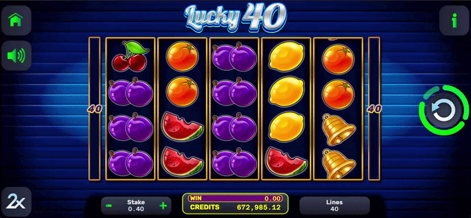

# Lucky40

A classic, high-performance video slot featuring a 5x4 grid and a fixed 40-line paytable. This title is engineered for high-frequency hit rates and a streamlined, traditional gameplay experience.

---

## 🕹 Technical Specifications

* **Grid Layout:** 5 Reels, 4 Rows.
* **Win Lines:** 40 fixed paylines.
* **Evaluation:** Standard left-to-right payline evaluation.
* **Core Mechanics:** **Classic Spin:** Optimized reel-stop logic for precise symbol alignment.
    * **High-Density Grid:** The 5x4 matrix is tuned for multi-line win combinations across the 40-line structure.
* **Bonus Features:** **Classic Gamble:** A post-win "Red or Black" card game for a 50/50 double-or-nothing stake, integrated into the win-cycle state machine.
    * **Feature Note:** This title focuses on base-game volatility and does not include a Free Spins sub-session.

## 🛠 Architecture & Performance

* **Payline Engine:** Optimized algorithm for rapid 40-line win evaluation, designed for low latency and high scalability.
* **Rendering & Animation:** WebGL-based reel rotations with motion blur effects to enhance the classic spinning feel at 60 FPS.
* **State Machine:** Robust state management handling rapid spin sequences and gamble transitions.
* **Memory Management:** Efficient asset loading and sprite usage, ensuring high performance on lower-end mobile devices.

## 🎬 Gameplay Showcase
> [!NOTE]
> Technical demonstration of reel transitions and expansion logic.

<p align="center">
   
   
</p>

<p align="center">
   
</p>

---

## 🚀 Setup & Installation

1. **Clone the repository:**
   ```bash
   git clone https://github.com/darchy/lucky40.git
2. **Install all dependencies:**
   ```bash
   yarn install
3. **Link the previously cloned framework:**
   ```bash
   yarn link nzl_fwk
4. **Launch the game:**
   ```bash
   yarn launch
